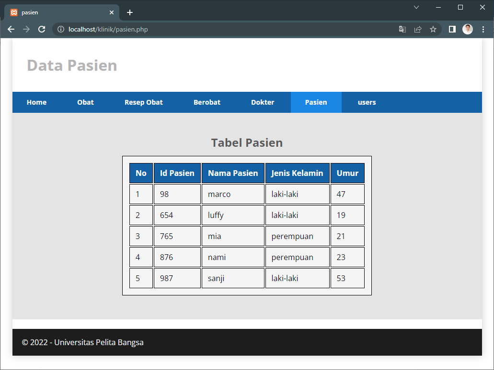
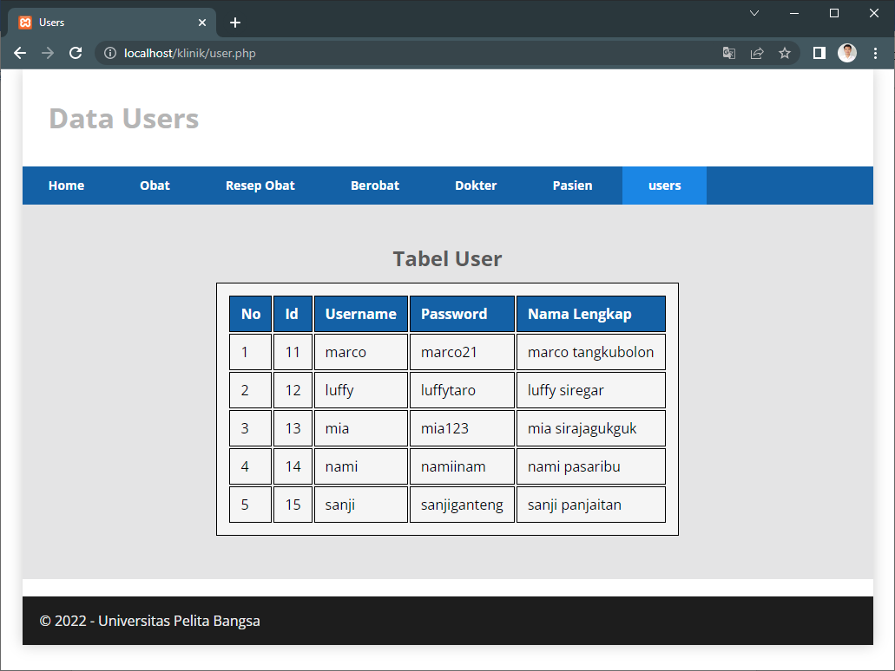

# TUGAS 5

- Nama : Zikri Hadiansyah
- Nim : 312010069
- Kelas : TI.20.D.1
- Matkul : Sistem Basis Data

# Soal

1. Menggunkan data yang dibuat dari soal Uts kemarin,Buat koneksi dengan php / bhs pemrograman lain.
2. Tampilkan data tabelnya masing2

# Desain Database

# Screenshot Website

- Home
  

- Tabel Pasien
  

- Tabel Obat
  

- Tabel Dokter
  

- Tabel Berobat
  

- Tabel Resep Obat
  

- Tabel Users
  
